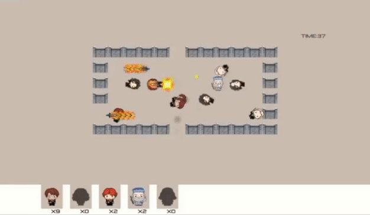

# Tower-Defense
A tower defense game developed using C++ and the Allegro 5 library, showcasing object-oriented programming principles and efficient game mechanics.

## Demo video

Here's a video demonstration of my project:

### Part1

### Part2

### Part3

